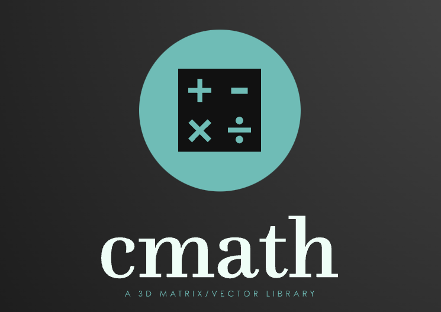

# cmath

Cross platform library for vector and matrix math



# example

## camera

```c++
// camera_lookat
{
    mat4 view1, view2;
    vec3 center, eye = {0.024f, 14.6f, 67.04f}, dir = {0.0f, 0.0f, -1.0f}, up = {0.0f, 1.0f, 0.0f};

    glm_vec3_add(eye, dir, center);
    glm_lookat(eye, center, up, view1);

    glm_look(eye, dir, up, view2);
```
